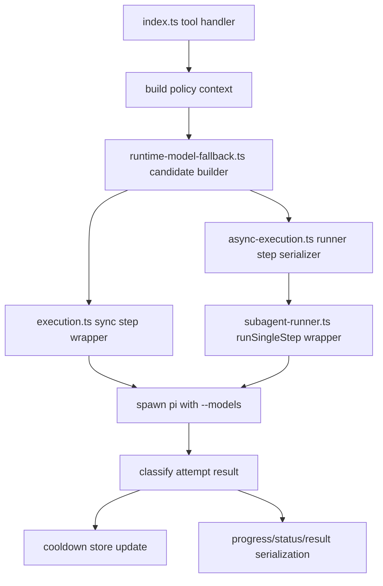

# ✨ feat: Add runtime model fallback policy

## Overview

Add a centralized runtime model fallback policy to `pi-subagents` so delegated runs can recover from classified model/provider/runtime failures without hiding deterministic task mistakes. This extends the current one-shot model selection flow into an explicit execution policy shared by sync single, sync parallel, sync chain, async single, and async chain execution (see brainstorm: `docs/brainstorms/2026-03-11-runtime-model-fallback-brainstorm.md`).

This plan intentionally keeps v1 narrow:

- preserve existing precedence semantics
- add only the smallest useful config surface
- avoid provider-specific routing tables in v1
- make fallback behavior visible in progress, status, logs, and final results

## Problem Statement / Motivation

Today the extension resolves a model once and then lets the child Pi process either run or fail:

- sync single uses `modelOverride ?? agent.model` and passes it via `--models` (`execution.ts:82-87`)
- async chain serializes `step.model ?? agent.model` into the runner (`async-execution.ts:170`)
- async single serializes only `agentConfig.model`, so a runtime single-agent override can be lost in background mode (`async-execution.ts:286`, `index.ts:765`, `index.ts:780`)
- sync chain normalizes bare model IDs against `ctx.modelRegistry` (`chain-execution.ts:42-57`, `chain-execution.ts:148`), while async execution does not

That drift has already produced regressions in this area:

- `/run` model override silently dropped (`CHANGELOG.md:190`)
- thinking level ignored in async mode (`CHANGELOG.md:193`)
- step-level model override ignored in async mode (`CHANGELOG.md:194`)

The new feature should solve the actual problem, not just add retries in one path. The policy must be centralized so sync/async/chain/parallel behavior stays aligned (see brainstorm: `docs/brainstorms/2026-03-11-runtime-model-fallback-brainstorm.md`).

## Carried-Forward Brainstorm Decisions

The following decisions are non-negotiable inputs to implementation:

- **Candidate order remains explicit and predictable**: explicit invocation or step/task model override → agent frontmatter model → parent session current model → configured fallback list (see brainstorm: `docs/brainstorms/2026-03-11-runtime-model-fallback-brainstorm.md`).
- **Fallback is only for classified runtime/provider failures** such as auth expiry, quota/rate limiting, provider outages, model unavailability, tool-schema incompatibility, and transient transport/API 5xx/network failures (see brainstorm: `docs/brainstorms/2026-03-11-runtime-model-fallback-brainstorm.md`).
- **Deterministic task errors must fail immediately**: bad paths, missing files, malformed inputs, prompt/task mistakes, and similar user-caused problems are not retryable (see brainstorm: `docs/brainstorms/2026-03-11-runtime-model-fallback-brainstorm.md`).
- **v1 config stays minimal**: `preferCurrentSessionModel`, `fallbackModels`, and `cooldownMinutes` only (see brainstorm: `docs/brainstorms/2026-03-11-runtime-model-fallback-brainstorm.md`).
- **No `providerFallbacks` in v1**. Ordered fallback lists are enough for the first release (see brainstorm: `docs/brainstorms/2026-03-11-runtime-model-fallback-brainstorm.md`).
- **Cooldown is session-scoped** and can escalate from model-level to provider-level only when the failure is clearly provider-wide (see brainstorm: `docs/brainstorms/2026-03-11-runtime-model-fallback-brainstorm.md`).
- **Fallback must be visible** in progress and final results: requested model, attempted models, chosen model, and reason (see brainstorm: `docs/brainstorms/2026-03-11-runtime-model-fallback-brainstorm.md`).
- **`ctx.modelRegistry` is metadata, not policy**. It can normalize model IDs but must not decide whether fallback happens (see brainstorm: `docs/brainstorms/2026-03-11-runtime-model-fallback-brainstorm.md`).

## Proposed Solution

Introduce a shared fallback policy module plus a shared execution wrapper that every delegated step uses before spawning Pi. The wrapper will:

1. build an ordered candidate list
2. dedupe candidates while preserving precedence
3. skip cooled-down candidates when allowed
4. execute attempts one model at a time
5. classify the failure after each attempt
6. stop immediately on deterministic errors
7. retry on classified runtime/provider failures until a candidate succeeds or the list is exhausted
8. record structured attempt history for progress, async status, logs, and final results

### Policy contract

Create a new shared module, likely `runtime-model-fallback.ts`, with a contract close to:

```ts
// runtime-model-fallback.ts
export interface RuntimeModelFallbackConfig {
  preferCurrentSessionModel?: boolean;
  fallbackModels?: string[];
  cooldownMinutes?: number;
}

export interface ModelCandidate {
  model: string;
  source: "override" | "agent" | "session" | "fallback";
  normalizedModel?: string;
}

export interface ModelAttempt {
  model: string;
  source: "override" | "agent" | "session" | "fallback";
  outcome: "success" | "failed" | "skipped";
  classification?: "retryable-runtime" | "deterministic" | "cooldown" | "unknown";
  reason?: string;
  cooldownScope?: "model" | "provider";
}
```

### Config shape

Use the existing extension config file and keep the new surface top-level for v1 simplicity:

### `~/.pi/agent/extensions/subagent/config.json`

```json
{
  "asyncByDefault": false,
  "preferCurrentSessionModel": true,
  "fallbackModels": [
    "anthropic/claude-sonnet-4-5",
    "openai/gpt-4.1"
  ],
  "cooldownMinutes": 15
}
```

This honors the brainstorm’s minimal-config decision without introducing a second nested policy namespace (see brainstorm: `docs/brainstorms/2026-03-11-runtime-model-fallback-brainstorm.md`).

## Technical Approach

### 1. Candidate construction

Build the attempt list in this exact order:

1. explicit invocation or step/task override
2. agent frontmatter model
3. parent session active model snapshot
4. `fallbackModels`

Rules:

- dedupe by normalized model identity while preserving first occurrence order
- keep the original requested string for display even when normalization adds `provider/`
- apply thinking suffix once, after model source resolution and before dedupe
- if the parent session model is unavailable in context, skip that source rather than guessing
- explicit override is always attempted first for the current run and is **not silently skipped** by an older cooldown entry; it remains the user’s deliberate choice

### 2. Shared normalization rules

Unify sync and async normalization so both follow the same rules now split between `execution.ts`, `chain-execution.ts`, and `async-execution.ts`:

- use `ctx.modelRegistry` only to normalize bare IDs to `provider/id` when possible (`chain-execution.ts:42-57`, `chain-execution.ts:148`)
- preserve raw strings when no registry match exists
- keep `--models` as the only spawn flag for child Pi invocations (`execution.ts:87`, `subagent-runner.ts:286`)
- ensure async single gets the same runtime model override support as sync single (`async-execution.ts:286`, `index.ts:780`)

### 3. Failure classification

Add a **new** runtime failure classifier. Do **not** overload `detectSubagentError()` in `utils.ts:188-258`, because that helper is tuned for tool/task failure detection after agent execution, not provider/runtime retry policy.

Classifier inputs should come from a richer attempt result envelope:

- exit code
- stderr text
- stdout tail / output tail
- final surfaced error string
- sync JSONL messages when available

Retryable classes for v1:

- auth expiry / invalid or expired credentials
- rate limiting / quota exhaustion / 429
- provider outage / overloaded / unavailable / model unavailable
- transient transport failures (`ECONNRESET`, `ETIMEDOUT`, connection resets, gateway failures)
- API 5xx family
- clear tool-schema incompatibility with the current model/provider

Non-retryable classes for v1:

- bad path / missing file / invalid cwd
- malformed input or invalid arguments
- deterministic task/prompt mistakes
- write/read/bash/tool errors caused by the task itself

Implementation note:

- sync execution already captures `stderr` separately (`execution.ts:331-353`)
- async runner currently writes `stderr` to the output file but does not return it from `runPiStreaming()` (`subagent-runner.ts:100-129`)
- to keep parity, the attempt executor should return `stdout`, `stderr`, `exitCode`, and any parsed metadata in both sync and async modes

### 4. Session-scoped cooldown store

Implement a shared cooldown store keyed by the parent session, not just the current process. The best v1 home is under the existing derived subagent session root:

- base path comes from `getSubagentSessionRoot(parentSessionFile)` (`index.ts:67-74`)
- store a small JSON file such as `runtime-model-fallback-cooldowns.json`
- key entries by normalized model, with optional provider-wide entries when classification is clearly provider-wide

Why file-backed instead of memory-only:

- sync and async runs live in different processes
- concurrent background runs need to see the same cooldown picture
- this preserves the brainstorm requirement that cooldown is session-scoped (see brainstorm: `docs/brainstorms/2026-03-11-runtime-model-fallback-brainstorm.md`)

### 5. Async snapshotting

Capture the parent session model **once** when delegation begins and serialize it into the sync or async execution context. Do not re-read the parent session’s live model during later fallback attempts.

Benefits:

- stable behavior across long-running async jobs
- deterministic logs and tests
- no hidden inheritance magic beyond the single ambient fallback candidate (see brainstorm: `docs/brainstorms/2026-03-11-runtime-model-fallback-brainstorm.md`)

### 6. Step-level retry boundary

Retry only the **failing step**, never the entire chain.

- sync chain: retry the current sequential or parallel task slot only
- async chain: retry the serialized failing runner step only
- previous completed steps are not re-run

This avoids duplicating earlier chain side effects and matches the brainstorm’s shared-wrapper direction (see brainstorm: `docs/brainstorms/2026-03-11-runtime-model-fallback-brainstorm.md`).

### 7. Observability contract

Extend sync and async result/status structures so users can see exactly what happened.

Suggested additions:

- `requestedModel`
- `finalModel`
- `modelAttempts: ModelAttempt[]`
- `fallbackSummary`

Suggested progress messages:

- `model: anthropic/claude-sonnet-4-5 (source: override)`
- `fallback: retryable-runtime (429 rate limit), trying openai/gpt-4.1`
- `fallback: skipped google/gemini-2.5-pro (provider cooldown)`
- `fallback: exhausted 3 candidates; last error was provider unavailable`

Suggested async status additions:

- per-step current requested model
- final chosen model when complete
- attempt count
- last fallback reason

Current gaps to close:

- `AsyncStatus.steps` only stores agent/status/duration/tokens/skills (`types.ts:155`)
- async result serialization omits attempt/model metadata (`subagent-runner.ts:749-775`)

## File-by-File Plan

- [x] **`types.ts`**
  - extend `ExtensionConfig` with `preferCurrentSessionModel`, `fallbackModels`, and `cooldownMinutes`
  - add shared `ModelCandidate` / `ModelAttempt` / fallback result types
  - extend `SingleResult`, `Details`, and `AsyncStatus`-related step metadata with requested/final model and attempt history

- [x] **`index.ts`**
  - load the new config fields from `~/.pi/agent/extensions/subagent/config.json` (`index.ts:76-80`)
  - capture the invoking session’s model snapshot if available
  - pass fallback context into sync single, sync parallel, sync chain, async single, and async chain paths
  - fix async single so runtime single-agent model overrides reach background execution (`index.ts:765`, `index.ts:780`)

- [x] **`runtime-model-fallback.ts`** *(new file)*
  - build candidate lists
  - normalize + dedupe candidates
  - classify retryable vs deterministic failures
  - manage session cooldown reads/writes
  - format structured fallback summaries for UI/log/result consumers

- [x] **`execution.ts`**
  - replace one-shot model resolution (`execution.ts:82-87`) with the shared fallback wrapper
  - keep spawn semantics on `--models`
  - surface structured attempt history in `SingleResult`

- [x] **`async-execution.ts`**
  - add `modelOverride` and serialized fallback context to `AsyncSingleParams`
  - serialize the parent session model snapshot and fallback config into runner steps
  - stop duplicating model resolution logic across async single and async chain (`async-execution.ts:170`, `async-execution.ts:286`)

- [x] **`subagent-runner.ts`**
  - make `runSingleStep()` execute through the shared fallback attempt loop instead of one model string only
  - return richer attempt envelopes including stderr and classification inputs
  - persist per-step attempt history into status, run log, and result JSON (`subagent-runner.ts:405-429`, `subagent-runner.ts:749-775`)

- [x] **`chain-execution.ts`**
  - remove model-resolution drift by routing sync steps through the same candidate builder used elsewhere
  - preserve chain-specific behavior like `{previous}` wiring and progress rendering while delegating model policy to the shared module

- [x] **`README.md`**
  - document fallback precedence, config fields, cooldown behavior, and observability output
  - call out that v1 does not support `providerFallbacks`

- [x] **`CHANGELOG.md`**
  - add release notes focused on parity across sync/async/chain/parallel and visible fallback attempts

- [x] **`test/helpers.ts`**
  - add helpers for non-empty model registries so tests can cover normalization parity (`test/helpers.ts:200`)

- [x] **`test/single-execution.test.ts`**
  - add candidate-order, retryable fallback, deterministic-stop, and cooldown assertions

- [x] **`test/chain-execution.test.ts`**
  - add sequential chain fallback tests and step-only retry assertions

- [x] **`test/parallel-execution.test.ts`**
  - add top-level parallel fallback parity checks for per-task overrides and isolated failures

- [x] **`test/async-execution.test.ts`**
  - expand beyond utility tests to cover async single and async chain fallback/status serialization

- [x] **`test/error-handling.test.ts`**
  - add explicit classifier tests for retryable runtime/provider failures vs deterministic task errors

## Implementation Phases

### Phase 1: Shared policy contract

- [x] Create `runtime-model-fallback.ts`
- [x] Define candidate, attempt, classifier, and cooldown types in `types.ts`
- [x] Extend `ExtensionConfig` and load config in `index.ts`
- [x] Add unit tests for candidate ordering, dedupe, normalization fallback, and cooldown decisions in `test/error-handling.test.ts`

**Exit criteria**

- candidate construction matches brainstorm order
- classifier distinguishes retryable runtime failures from deterministic task failures
- cooldown persistence is session-scoped and file-backed

### Phase 2: Sync path integration

- [x] Integrate shared fallback wrapper into `execution.ts`
- [x] Route sync chain and top-level parallel through the same model policy path from `chain-execution.ts` and `index.ts`
- [x] Add sync observability fields to result objects
- [x] Add sync single, chain, and parallel coverage in `test/single-execution.test.ts`, `test/chain-execution.test.ts`, and `test/parallel-execution.test.ts`

**Exit criteria**

- sync single, sync chain, and sync parallel share the same precedence and retry behavior
- explicit override still wins
- deterministic errors stop immediately

### Phase 3: Async parity + observability

- [x] Add async single model override support in `async-execution.ts`
- [x] Integrate fallback loop into `subagent-runner.ts`
- [x] Persist attempt history into async status, log, and final result JSON
- [x] Expand `test/async-execution.test.ts` beyond status utilities

**Exit criteria**

- async single and async chain match sync behavior
- background status clearly shows attempt history and final model choice
- runner logs/results preserve fallback reasons

## Alternative Approaches Considered

### Rejected: patch each execution path independently

This was explicitly rejected in the brainstorm because it would recreate the same drift that already caused model-override and thinking-level bugs in async mode (see brainstorm: `docs/brainstorms/2026-03-11-runtime-model-fallback-brainstorm.md`; `CHANGELOG.md:190-194`).

### Rejected: sync-only v1

Smaller to ship, but wrong architectural boundary. The feature is about delegated execution policy, not only the sync path. Shipping sync-only would guarantee immediate behavioral drift (see brainstorm: `docs/brainstorms/2026-03-11-runtime-model-fallback-brainstorm.md`).

### Rejected: provider-specific routing tables in v1

`providerFallbacks` is deliberately out of scope for the first release. Ordered fallback lists plus provider-wide cooldown are enough for the initial value without expanding config complexity (see brainstorm: `docs/brainstorms/2026-03-11-runtime-model-fallback-brainstorm.md`).

## Non-Goals

- adding provider-specific routing rules or weighted policies in v1
- changing existing explicit/agent precedence semantics
- making `ctx.modelRegistry` authoritative for policy decisions
- retrying deterministic task, path, or input errors
- re-running already completed earlier chain steps

## System-Wide Impact

### Interaction Graph



Two-level trace examples:

- **sync single**: `index.ts` captures override/config/session context → `execution.ts` asks shared wrapper for candidate execution → child Pi spawn emits messages/stderr → classifier decides retry/stop → `SingleResult` returns attempt history.
- **async chain**: `index.ts` captures session context → `async-execution.ts` serializes runner step context → `subagent-runner.ts` performs per-step fallback attempts → status/result/log writers persist attempt history for `subagent_status` readers.

### Error & Failure Propagation

- **Retryable runtime/provider failure**: attempt fails → classifier marks retryable-runtime → cooldown optionally updated → next candidate runs → final result records both failed and successful attempts.
- **Deterministic task failure**: attempt fails → classifier marks deterministic → no further candidates run → error surfaces immediately.
- **Exhausted candidates**: all remaining candidates fail or are skipped → final result reports exhaustion summary plus last error and full attempt history.

Important boundary:

- `detectSubagentError()` remains for task/tool failure interpretation after execution (`utils.ts:188-258`)
- runtime fallback should use its own classifier so it does not mistake user/task problems for retryable provider outages

### State Lifecycle Risks

- a retry can re-execute tools inside the same step, so side effects may repeat
- whole-chain replay is disallowed; only the failing step may retry
- cooldown persistence must be atomic enough to avoid corrupting the shared session cache under concurrent async runs
- async status/result writes must remain backward-safe if a run fails mid-attempt

Mitigations:

- keep retries limited to new candidates only
- surface attempt history clearly
- use file writes that replace the full JSON atomically where practical
- document side-effect caveats in `README.md`

### API Surface Parity

Equivalent interfaces that must behave the same after this change:

- `subagent` single execution with `agent` + `task`
- top-level parallel execution via `tasks: [...]`
- chain execution via `chain: [...]`
- clarify TUI single-agent background launch path (`index.ts:732-807`)
- manager / slash-command launches that already route through the tool handler (`CHANGELOG.md:190-194`)

Parity requirement:

- same candidate ordering
- same cooldown semantics
- same retry classifier
- same attempt history fields

### Integration Test Scenarios

1. **`test/single-execution.test.ts`**: explicit override rate-limits, agent model succeeds on second attempt, result shows two attempts and final chosen model.
2. **`test/chain-execution.test.ts`**: second step hits provider outage on first model, retries only step 2 on fallback model, step 1 is not re-run.
3. **`test/parallel-execution.test.ts`**: one parallel task falls back successfully while another task succeeds immediately; task-local attempt histories remain isolated.
4. **`test/async-execution.test.ts`**: background single run launched with a runtime model override preserves that override, retries on retryable failure, and persists attempt history to `status.json` and result JSON.
5. **`test/error-handling.test.ts`**: missing file / invalid path error never triggers fallback even if fallback models are configured.

## Acceptance Criteria

### Functional Requirements

- [x] Ordered candidate construction is exactly: explicit override → agent frontmatter → parent session model snapshot → `fallbackModels` (see brainstorm: `docs/brainstorms/2026-03-11-runtime-model-fallback-brainstorm.md`).
- [x] Candidate dedupe preserves first occurrence order.
- [x] `preferCurrentSessionModel=false` removes the parent session model candidate without changing the rest of the order.
- [x] Sync single, sync parallel, sync chain, async single, and async chain all use the same fallback policy.
- [x] Async single honors runtime model overrides in background mode.
- [x] Fallback happens only for classified runtime/provider failures.
- [x] Deterministic task/path/input errors stop immediately and do not advance to fallback candidates.
- [x] Provider-wide cooldown can suppress later candidates only when the failure is clearly provider-wide.
- [x] Explicit override is attempted first for the current run and is never silently skipped by a prior cooldown entry.
- [x] Chain retries are limited to the failing step or parallel task slot.

### Observability Requirements

- [x] Sync results include `requestedModel`, `finalModel`, and structured `modelAttempts`.
- [x] Async `status.json`, run log markdown, and final result JSON include model attempt history.
- [x] Progress output shows the retry reason and next candidate when fallback occurs.
- [x] Final failure output distinguishes deterministic-stop vs exhausted-retryable-candidates.

### Quality Gates

- [x] Add or update tests in `test/single-execution.test.ts`.
- [x] Add or update tests in `test/chain-execution.test.ts`.
- [x] Add or update tests in `test/parallel-execution.test.ts`.
- [x] Add or update tests in `test/async-execution.test.ts`.
- [x] Add or update tests in `test/error-handling.test.ts`.
- [x] Keep `--models` as the only child Pi model flag in sync and async paths.
- [x] Update `README.md` and `CHANGELOG.md` for the new behavior.

## Success Metrics

- model-selection behavior is identical across all supported execution modes
- background runs no longer drop single-agent model overrides
- transient provider/runtime failures recover without masking deterministic task mistakes
- users can explain any fallback outcome from status/log/result artifacts alone
- no new parity regressions are introduced in slash-command or manager launch flows

## Dependencies & Risks

### Dependencies

- current child Pi invocation contract must continue to accept `--models`
- access to the parent session root is required for session-scoped cooldown persistence (`index.ts:67-74`)
- implementation needs a reliable way to snapshot the invoking session’s current model from extension context

### Risks

- **classification false positives** could retry task errors that should fail fast
- **classification false negatives** could miss recoverable provider failures
- **side-effect duplication** remains possible when a step fails after tool execution started
- **async parity drift** can reappear if the runner path keeps its own model logic
- **cooldown race conditions** are possible if multiple async runs write the same session cache unsafely

### Mitigation

- keep the classifier conservative and heavily tested
- isolate policy in one shared module
- persist structured attempt history for debugging
- use file-backed cooldown storage with replace-on-write semantics

## Documentation Plan

- update `README.md` configuration examples with `preferCurrentSessionModel`, `fallbackModels`, and `cooldownMinutes`
- add a short "Runtime model fallback" section describing precedence, retry boundaries, cooldown, and known caveats
- add `CHANGELOG.md` notes calling out async-single parity and attempt-history observability

## Open Implementation Notes

These are planning-level notes, not scope expansions:

- confirm the exact `ExtensionContext` field used to snapshot the parent session’s active model; if unavailable, omit that candidate cleanly instead of inferring one
- make async runner attempt classification use returned `stderr`, not only combined output logs
- prefer additive result fields over breaking existing consumers of `SingleResult` / async status payloads

## Sources & References

### Origin

- **Brainstorm document:** [docs/brainstorms/2026-03-11-runtime-model-fallback-brainstorm.md](../brainstorms/2026-03-11-runtime-model-fallback-brainstorm.md)
  - carried forward: centralized policy + shared wrapper
  - carried forward: parent session model as fallback candidate
  - carried forward: minimal config only (`preferCurrentSessionModel`, `fallbackModels`, `cooldownMinutes`)
  - carried forward: no `providerFallbacks` in v1

### Internal References

- one-shot sync model resolution: `execution.ts:82-87`
- sync stderr capture already exists: `execution.ts:331-353`
- async chain model serialization: `async-execution.ts:170`
- async single currently uses only agent model: `async-execution.ts:286-304`
- async single background launch path: `index.ts:765`, `index.ts:780`
- chain model normalization helper: `chain-execution.ts:42-57`
- chain model registry usage: `chain-execution.ts:148`
- documented precedence rule: `README.md:107`
- current async status step shape is too narrow for attempt history: `types.ts:155`
- async final result serialization currently omits model attempts: `subagent-runner.ts:749-775`
- existing task/tool error detector to keep separate from retry classifier: `utils.ts:188-258`
- test helper currently uses empty model registry: `test/helpers.ts:200`

### Institutional Learnings

- no `docs/solutions/` directory exists in this repo; institutional context is currently in the brainstorm, changelog, tests, and git history
- historical regression cluster for model parity across sync/async/tool paths: `CHANGELOG.md:190-194`
- child Pi must use `--models`, not `--model`, to avoid silent default fallback behavior: commit `fc4fdb9`

### Related Work

- related fix commit: `fc4fdb9` — `fix: model override silently ignored — use --models instead of --model`
- related merge/PR reference in git history: `b084722` / PR `#20`

### External References

- external web research intentionally skipped for this plan because local repo context and the existing brainstorm were sufficient
